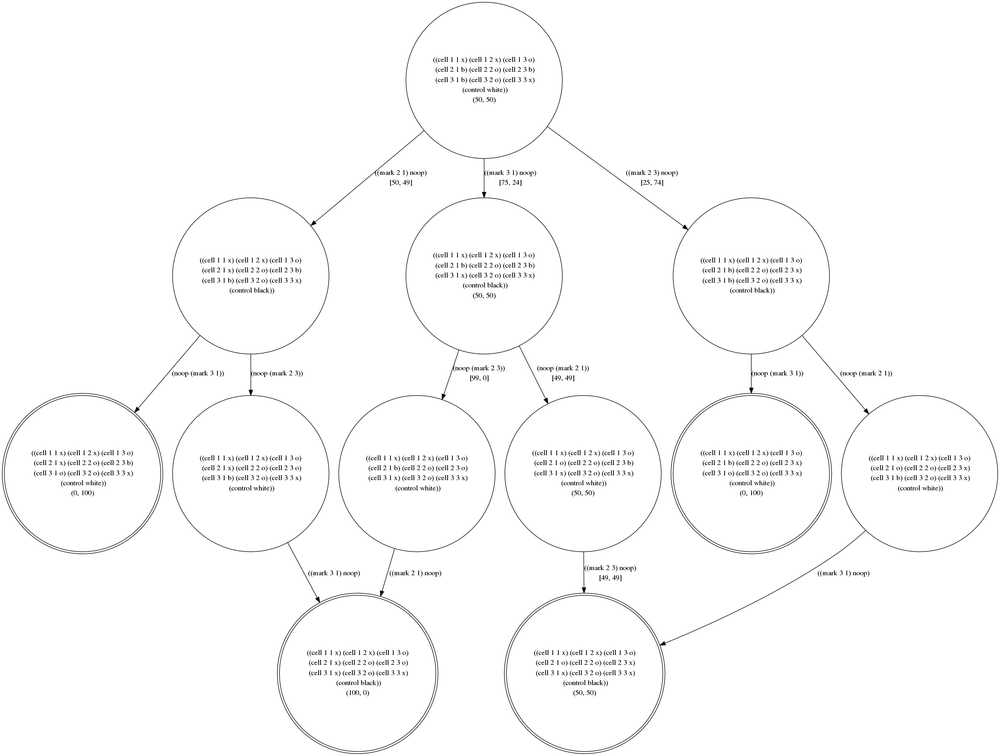

<h1>A Python script for Coursera's General Game Playing course</h1>

This is my attempt to write a Python player for Coursera's <a href="https://www.coursera.org/course/ggp">General Game Playing</a> course offered by Stanford University's Professor Michael Genesereth.

It requires Prolog &mdash; <a href="http://www.dcc.fc.up.pt/~vsc/Yap/">yap</a>, <a href="http://www.swi-prolog.org/">swipl</a> or any other <a href="http://www.gprolog.org/">Prolog</a> should work provided it can be called from the command line as a script.

After many hours of trying to write my own interpreter and looking at the various Prolog interfaces available for Python, I opted for the kludge of having my Python script generate a Prolog script which is then executed by <a href="https://docs.python.org/2/library/subprocess.html"><code>subprocess.check_output(...)</code></a>, the output of which is then read back into the Python script &mdash; not an elegant or pretty solution, but it does have the advantage it should work with whatever flavour of Prolog you like.

Near the top of my script you'll see:  <code>
PROLOG = '#!/usr/bin/yap -L --' 
# PROLOG = '#!/usr/bin/swipl -f -q'</code>

Switching between yap and swipl just involves moving the comment hash, and using a completely different Prolog means looking up how to call it. You may also need to edit the path if your Prolog isn't in /usr/bin.

At this stage it needs python2.7 or higher (for argparse) but doesn't work with python3 (yet) because of its dependency on BaseHTTPServer.

The default hostname is 127.0.0.1 and port is 9147 which can be changed by calling, say, <code>python2.7 ggp_python_player.py -n 171.64.71.18 -p 9148</code>.

Adding <code>-g <i>filename</i></code> will generate a <a href ="http://www.graphviz.org/content/dot-language">graphviz dot</a> file which can the be used to generate a graphic of the game tree like the example below.

I'm only an intermediate Python and novice Prolog programmer, so suggestions from advanced programmers on how to improve this code will be gladly accepted.

<h2>Game Description Language (GDL)</h2>

A key job of this script is to interpret <a href="http://logic.stanford.edu/classes/cs227/2013/readings/gdl_spec.pdf"> Game Description Language (GDL)</a> scripts sent to it via http by the general game playing server. A fine manual is available <a href="http://logic.stanford.edu/ggp/chapters/cover.html">online</a>.

Using a partially completed game of Tic Tac Toe used in <a href="http://ggp.stanford.edu/applications/060401.php">Exercise 6.4.1</a> as an example, the diagram (produced by graphiz from the python dictionary structure I use to store the game in) illustrates how the Montecarlo method explores the game tree and comes up a "best move" from a given state.
 

<object data="tictactoe1.svg" type="image/svg+xml" width="1000">
  

</object>

<h2>Glossary</h2>
<dl>
<dt><a href="https://en.wikipedia.org/wiki/Game_tree">Game Tree</a></dt>
<dd>A directed graph whose nodes are positions in a game and whose edges are moves.</dd>
<dt><a href="https://en.wikipedia.org/wiki/Percept_%28artificial_intelligence%29">Percept</a></dt>
<dd>A percept is detected and acted upon by an actuator.</dd>
<dt><a href="https://en.wikipedia.org/wiki/Ply_%28game_theory%29">Ply</a></dt>
<dd>One ply corresponds to one level of the game tree. </dd>
</dl>

